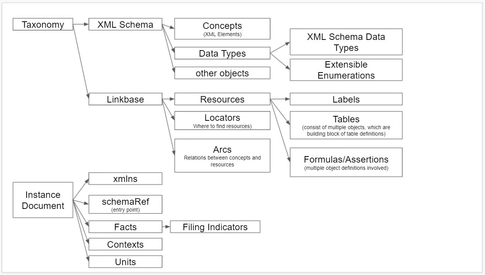
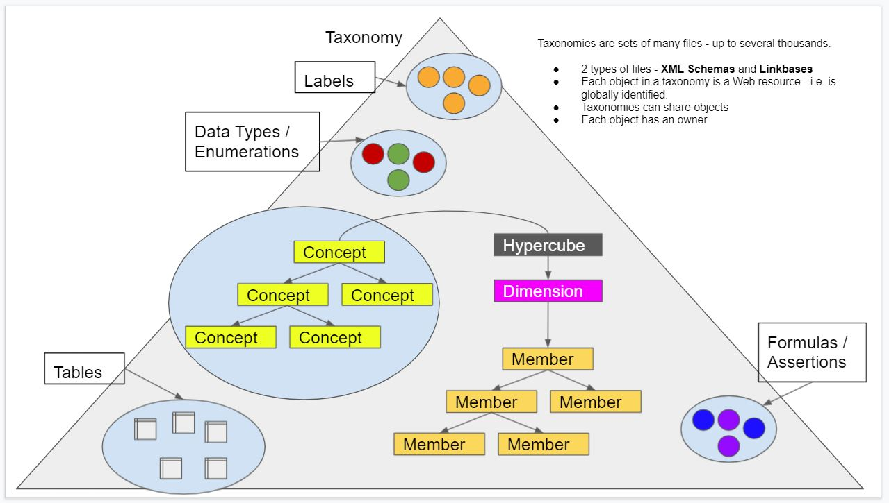
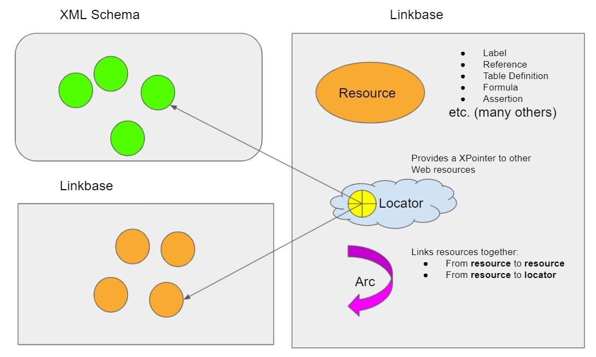

# XBRL Objects

| **Taxonomy**                                                 | **Instance Document**                                        |
| ------------------------------------------------------------ | ------------------------------------------------------------ |
| **Contains metadata** Knowledge about how to produce instance documents | **Contains data**                                            |
| **Web resource** Similar to a database with normative information Taxonomies can share objects All objects within a taxonomy are **globally** identified | **Mainly used to transmit data between reporting entity and consumer** Facts within an XBRL instance are **not** globally addressable. XBRL instance documents cannot share facts. |
| **Multiple files** Files are discovered by following links between them. To start the discovery process we need an **entry point**. | **Single file** However, XBRL instances can be part of larger filings. |
|                                                              | **No structure**  There is no information in the XBRL instance document about how to order facts. |
| **Includes concepts**                                        | **Includes facts** (instances of concepts)               |

An XBRL Taxonomy is a collection of taxonomy schemas and linkbases. A taxonomy schema is an XML schema document (file). Linkbases are XML documents (file) which follow the XLink specification. The schema must ultimately extend the XBRL instance schema document and typically extend other published XBRL schemas on the xbrl.org website.

XBRL Taxonomy can include: 

- Reporting concept definitions - XML elements, which can be instantiated in XBRL instance documents and provide values for reported facts.
- Dimension definitions - define how reporting facts can be grouped and analyzed
- Dimension member definitions - define domains for explicit dimensions
- Hypercube definitions - connect dimensions to reporting concepts and define [dimensional relationship sets](http://www.xbrl.org/specification/dimensions/rec-2012-01-25/dimensions-rec-2006-09-18+corrected-errata-2012-01-25-clean.html#term-dimensional-relationship-set). 
- Labels, which can be attached to all other objects by means ot label arcs
- Arcs, which can define various relationship between taxonomy objects - e.g. hierarchical relationships between reporting concepts.
- References to external normative documents (printed, or online)
- Table definitions to do rendering of taxonomy and XBRL instance information.
- Formulas to be used to process the content of the XBRL instance document and produce new content. In particular this can be Formula Assertions to validate instance documents.

Internally XBRL Taxonomies make use of [XML Linking Language (XLink)](https://www.w3.org/TR/xlink11/), which is a W3 standard.

