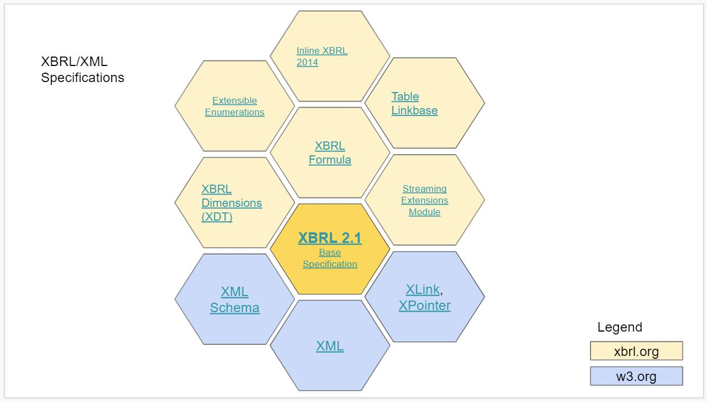

# XBRL Specifications

The XBRL Consortium has developed a number of [specifications](https://specifications.xbrl.org/specifications.html) for various cases in business reporting. This includes: 

XBRL 2.1.  - [https://www.xbrl.org/Specification/XBRL-2.1/REC-2003-12-31/XBRL-2.1-REC-2003-12-31+corrected-errata-2013-02-20.html](https://www.xbrl.org/Specification/XBRL-2.1/REC-2003-12-31/XBRL-2.1-REC-2003-12-31+corrected-errata-2013-02-20.html)

XBRL Dimensions - [https://www.xbrl.org/specification/dimensions/rec-2012-01-25/dimensions-rec-2006-09-18+corrected-errata-2012-01-25-clean.html](https://www.xbrl.org/specification/dimensions/rec-2012-01-25/dimensions-rec-2006-09-18+corrected-errata-2012-01-25-clean.html)

XBRL Extensible Enumerations - [https://www.xbrl.org/Specification/extensible-enumerations-2.0/REC-2020-02-12/extensible-enumerations-2.0-REC-2020-02-12.html](https://www.xbrl.org/Specification/extensible-enumerations-2.0/REC-2020-02-12/extensible-enumerations-2.0-REC-2020-02-12.html)

Taxonomy Packages - [https://www.xbrl.org/Specification/taxonomy-package/PR-2015-12-09/taxonomy-package-PR-2015-12-09.html](https://www.xbrl.org/Specification/taxonomy-package/PR-2015-12-09/taxonomy-package-PR-2015-12-09.html)

XBRL Formula - [https://www.xbrl.org/specification/formula/rec-2011-10-24/index-2011-10-24.htm](https://www.xbrl.org/specification/formula/rec-2011-10-24/index-2011-10-24.htm)

Table Linkbase - [https://www.xbrl.org/specification/table-linkbase/REC-2014-03-18/table-linkbase-REC-2014-03-18.html](https://www.xbrl.org/specification/table-linkbase/REC-2014-03-18/table-linkbase-REC-2014-03-18.html)

Inline XBRL - [https://www.xbrl.org/specification/inlinexbrl-part1/rec-2013-11-18/inlinexbrl-part1-rec-2013-11-18.html](https://www.xbrl.org/specification/inlinexbrl-part1/rec-2013-11-18/inlinexbrl-part1-rec-2013-11-18.html)

XBRL Streaming Extensions - https://www.xbrl.org/Specification/streaming-extensions-module/CR-2015-12-09/streaming-extensions-module-CR-2015-12-09.html

### Related W3 standards

XML Specification - [https://www.w3.org/TR/2006/REC-xml11-20060816/]( https://www.w3.org/TR/2006/REC-xml11-20060816/)

XML Schema - [https://www.w3.org/XML/Schema](https://www.w3.org/XML/Schema)

XML Linking Language (XLink) - [https://www.w3.org/TR/xlink11/](https://www.w3.org/TR/xlink11/)

