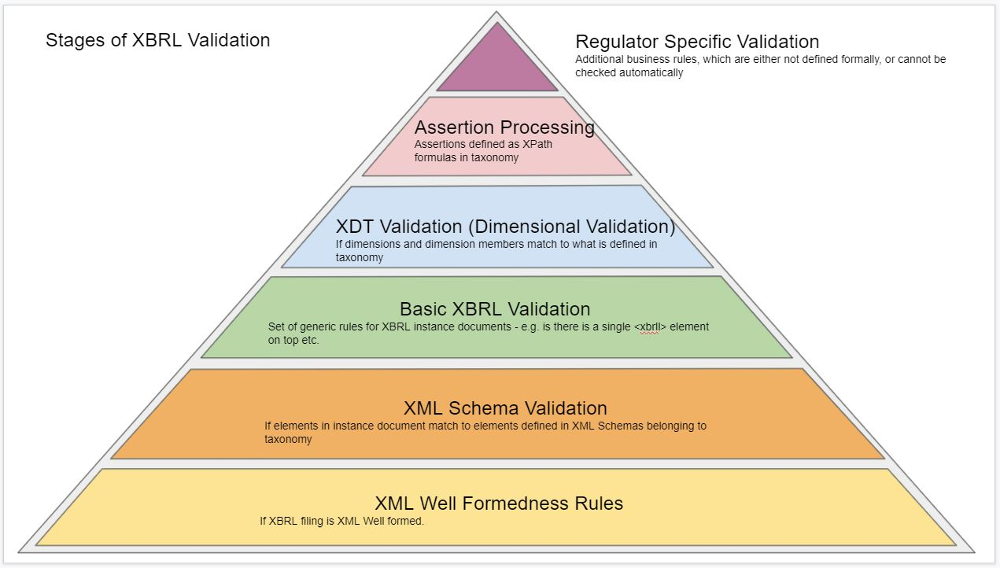

# XBRL Validation

XBRL allows formal validation of the content of business reports, which includes various levels:

**XML Well Formedness Rules** - Each XBRL instance document must be a well formed [XML](http://www.w3.org/TR/xml11/) file. This is checked by the XML parser of the consuming application when the document is loaded. If the document is not XML well formed, the load operation fails.

**XML Schema Validation** - Each XBRL instance document must be [XML Schema](http://www.w3.org/TR/xmlschema-0/) valid according XML schemas included in related taxonomy. Validation occurs either at the time document is loaded, or after the whole taxonomy is discovered and loaded in the processor.

**Basic XBRL Validation** - Each XBRL instance document must comply with rules described in the basic specification ([XBRL v2.1](http://www.xbrl.org/Specification/XBRL-2.1/REC-2003-12-31/XBRL-2.1-REC-2003-12-31+corrected-errata-2013-02-20.html)). Validation is done by XBRL aware software called **XBRL Processor**.

**XDT Validation** - XDT stands for “**X**BRL **D**imensional **T**axonomies”. In addition to basic validation, the “[XBRL Dimensions](http://www.xbrl.org/specification/dimensions/rec-2012-01-25/dimensions-rec-2006-09-18+corrected-errata-2012-01-25-clean.html)” specification defines additional restrictions about the content of XBRL instance document. Validation is done by a XDT-aware XBRL processor.

**Assertion Processing** - XBRL Formula specification defines a mechanism to define custom validation rules in a form of XPath expressions called “Assertions”. Validation is done by an XBRL Processor, which is able to recognize custom assertions defined in the taxonomy and evaluate related expressions. A XBRL instance document is valid if all related assertions evaluate to **true**.

**Regulator Specific Validation** - In many cases regulators and organizations, which consume XBRL instance documents define additional rules on top of formal rules defined in specification and taxonomies. These rules are checked either manually, or using specialized software. 

